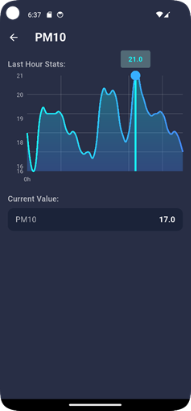

**IT 863: Internet of Things**

**Project Details**

**Instructor: Prof. Dr. Rafia Mumtaz**

**Spring 2025**

**Submitted By:**

||**Usama Shafique**|
| :- | :- |
||**Iqra Rani**|
||**Zuha Khalid**|
||**Fatima Tu Zahra**|

**Air Quality Monitoring using ESP32**

**Usama Shafique, Iqra Rani, Zuha Khalid, Fatima Tu Zahra**

**Project Description: (Brief introduction, objectives, expected outcomes)**

Air Quality Monitoring Systems help us detect and measure pollutants in the air which affect human health and the environment. They are essential to protect human health by identifying harmful pollutants like PM2.5, PM10, NOx, COx, and O3. These pollutants can trigger or lead to respiratory and cardiovascular diseases. Therefore, timely detection of these pollutants is important. In addition, it allows authorities to issue alerts when the air quality is dangerous, guiding them to take protective actions e.g., staying indoors and wearing masks. A deep analysis can help identify the main pollution generating spots (e.g. traffic signals where air quality is reduced due to congestion). These insights can help find regulatory solutions to a recurring problem.

**Application Requirements:**

The air quality monitoring system comprises two primary nodes: a transmitter and a receiver. The transmitter node is responsible for sensing environmental data, including pollutants (e.g., CO), particulate matter (PM2.5 and PM10), and meteorological parameters such as temperature and humidity. Using a microcontroller and an underlying wireless communication technology, this data is transmitted to the receiver node. The receiver node locally uploads the data to a cloud platform (ThingSpeak) for storage, visualization, and further processing, including Air Quality Index (AQI) computation. The system is required to maintain reliable wireless communication and update readings on ThingSpeak every few seconds. The final results are displayed on the mobile application.

**Hardware Details**

Details of sensors and related electronic equipment is as follows:

**Transmitter Node**

|**Hardware**|**Description**|
| :- | :- |
|MQ-7|Senses CO in the environment|
|PMS7003|Collects Particulate Matter data (PM2.5, PM10)|
|DHT22|Temperature and Humidity data|
|ESP32|For collection and transmission of data.|

**Receiver Node**

|**Hardware**|**Description**|
| :- | :- |
|ESP32|For collection and transmission of data.|

**Development board Details:**

- The development board being used in this project is ESP32. The reason being that ESP32 connects readily with Wi-Fi without the need of a Wi-Fi shield, allowing us to send data to the cloud easily for further analysis. 
- One of the main objectives of our project was to predict the AQI for the day for which we needed to send the data to the cloud. 
- In addition to that, the communication technology i.e. ESP-NOW is compatible with ESP32 boards which allow communication between them without the need for extra hardware.

**Circuit Diagram:**

|**Sensor**|**Pins**|
| - | - |
|DHT22|GND, VCC (Vin – 3.3V), PIN = DIGITAL 14 |
|MQ-7|GND, VCC (3.3V), PIN = ANALOG 32|
|PMS7003|GND, VCC (3.3V), PIN = DIG 19, DIG 18 (not used)|

**Communication Technology:** 

ESP-NOW is a fast wireless communication proprietary protocol developed by the ‘‘Espressif” organization. This communication is established between two or more ESP32 boards without the use of Wi-FI or Bluetooth.

According to Ibrahim [1], ESP-NOW has the following significant features by experimentation.

|Data Packet Size|250 bytes|
| - | - |
|Communication|Bidirectional|
|Number of slave nodes|7|
|Maximum Distance between nodes|15 meters (Indoors), 90 meters (outdoor)|
|Power Consumption|Low|

**Protocol Stack of ESP-NOW:**

This section is an overview of the protocol stack of ESP-NOW discussed by Urazayev in their paper [2].

|**Layer**|**Description**|
| :- | :- |
|Application Layer|HTTP, ESP32 to ThingSpeak |
|Data Link to Presentation Layer|Espressif’s API for sending/receiving messages|
|Network Access Layer|
Mac Layer: Implements peer-to-peer communication using IEEE 802.11 Wi-Fi MAC frames

Physical Layer: Uses Wi-Fi physical layer (2.4 GHz, same as 802.11 b/g/n)
|

` `

**Topologies supported by ESP-NOW:**

The table shows possible network topologies if the system is to be deployed in the real environment.

|**Topology**|**Figure**|
| - | - |
|**One Way Communication**||
|
**One-to One-**

In this type of communication methodology, the sent data may be sensor readings or controlling commands (Switching ON and OFF devices, Moving Servo motor, changing RGB color values or other command) 
|![ref1]|
|
**One to Many**

one ESP32 board transfer the same or different data to otherESP32 boards in a One-to-Many communication methodology.
|

|
|
**Many to One:**

one ESP32 board receives data from other ESP32 boards in a Many-to-One communication methodology.
||

|**Two Way Communication**||
| :-: | :- |
|
**One-to-One**

Two-way communication between ESP32 boards is supported through the ESP-NOW protocol. In this communication style, each board can act as both a sender and a receive.
|
![ref2]

|
|
**Many-to-many:**

The ESP-NOW two-way communication methodology is suitable for creating a mesh network in which many ESP32 boards can transfer data to each other. This methodology can be used to create a network for sharing sensor readings and monitoring system in weather station, construction sites and archaeological sites.
||

**Addressing Scalability in Real Environments:**

In a mesh or star network, there can be up to 20 peers. Given the range of ESP-NOW (50-100m) and the signal’s ability to attenuate while working in a complex environment, it would be able to cover a small building easily. 

||**Advantages**|**Limitations**|
| - | - | - |
|Scalability in a Star Network|
- Simple setup

- Centralized data collection (easy for gateways)

- Ideal for sensor networks, data aggregation
|
- Single Point of Failure

- Heavy computation on central node making it a bottleneck
|
|Scalability in a Mesh Network|- No single point of failure|- Increased complexity in forwarding and synchronizing data|

**Power consumption**

|**Sensor**|**Operating Voltage (V)**|**Current Consumption (mA)**|**Power Consumption (mW) = V × I**|
| - | - | - | - |
|MQ7 |3\.3 V|~150 mA (heater ON), ~10 mA (heater OFF)|495 mW (heater ON), 33 mW (heater OFF)|
|PMS7003|3\.3 V|~100 mA (peak during operation)|330 mW|
|DHT22|3\.3 V|~1.5 mA (during measurement)|4\.95 mW|
|ESP 32 Transmitter|5V power supply from USB port|||

|~150 mA|
| :- |

|||

||
| :- | :- | :- | :- |

|750 mW|
| :- |

|||||
| :- | :- | :- | :- |

**Data Visualization/Analysis and system interface:** 

To visualize and analyze the data, we have set up a system using ThingSpeak and Google Colab. The data that is sensed by the sensors is sent via ESP32 at the transmitter node to ESP32 at the receiver node. The data received is forwarded to an IoT-based cloud platform called ThingSpeak.

For analyzing the data and predicting the AQI levels in real-time, we have trained regression models using a publicly available dataset discussed in the next section. The collected data on ThingSpeak is preprocessed and passed through the ML models to give AQI as an output along with its category.

**Understanding the Dataset:**

|**Global Air Quality Dataset**||
| :-: | :- |
|Link|<https://www.kaggle.com/datasets/waqi786/global-air-quality-dataset>|
|Published|2024|
|Features||

**Features Concerned with our use case:**

|Features|
- Temperature (°C): Average temperature of the region.

- Humidity (%): Relative humidity recorded in the region.

- PM2.5 Concentration (µg/m³): Fine particulate matter levels.

- PM10 Concentration (µg/m³): Coarse particulate matter levels.

- CO Concentration (ppm): Carbon monoxide levels.
|
| :- | :- |

**Training the Machine Learning Model to Classify and Predict the Air Quality:**

1. Data Preprocessing: 
   1. We dropped the columns that did not correlate with our use case.
      

   1. Null values: No null values were present. The figure and the table show it.

  

- **Exploratory Data Analysis:**
  Outliers detection: Box plot was drawn to check any outliers. The figures show no such outliers was present.

  ![A group of blue squares

AI-generated content may be incorrect.]

  ![A group of blue squares

AI-generated content may be incorrect.]

  

- **Time Series Analysis:**
  For each of the pollutants, the quantity of each pollutant was checked against time. The values are averaged for 5 days to show a clear picture of the graph and any up and down trend.

  

  

  

1. Data Modelling

   To label the dataset, we have used a function called ‘cal\_aqi\_us’ which uses the US EPA AQI standard to calculate the AQI. The purpose of this function is to convert pollutant levels into AQI figures

We used a second function categorize\_aqi(aqi) which receives the AQI calculated from the previous function and allots a category to it as shown in the table above.

These values of “AQI” are then appended to the data.

1. Model Training:

   We up-sample the dataset using SMOTE to balance it. To train the regression model, we split the data into an 80-20 train and test split. The model accuracy and graphs are shown.

      

1. Fetching the Data from ThingSpeak

   The thingSpeak Dashboard has all the data collected from the receiver node. It dumps all the data and helps visualize the time-series graph of the collected values.

   |Field 1|PM1 (dropped during analysis since it’s not a part of the base dataset we are using)|
   | :- | :- |
   |Field 2|PM2.5|
   |Field 3|PM10|
   |Filed 4|Temperature|
   |Field 2|Humidity|
   |Field 6|CO|
   |

||

   We export this data using ThingSpeak READ API, pass it through our model and make our predictions.

   

1. Results:
   These are the results predicted by the model.

**Mobile & API Layer**

**Purpose:**

The Flutter app is the user-facing companion for the Air-Quality-IoT system. It consumes a small REST API and turns the raw sensor feed into an interactive dashboard, historical explorer and real-time alerting hub—all without exposing any of the ML training logic.

Outdoor air quality changes minute by minute, yet most low-cost sensor projects stop at uploading numbers to a database. The goal of this Flutter application is to translate those numbers into information a person can react to:

- at a glance – colored cards and a large AQI dial
- over time – a one-hour curved line chart and longer time-range views
- when it matters –notifications as soon as air becomes unhealthy

Everything happens on the phone; the only dependency is a tiny REST API that lives beside the ML model.

**High-level architecture:**

|**Layer**|**Technology**|**Responsibilities**|
| :- | :- | :- |
|**Sensor → ThingSpeak**|ESP32 + MQ-7 + PMS5003 + DHT22|Pushes a new row every ≈ 33 s|
|**Edge/Backend**|FastAPI (app.py) running on Localhost|Normalizes the feed, predicts ML-AQI, computes EPA break-points and exposes three JSON endpoints:/latest, /feeds?results=n, /forecast|
|**Mobile app**|Flutter 3.22 • Dart >=3|Pulls /latest every 30 s & /feeds on demand. Renders charts, cards and notifications|

**Mobile and API System Flow:**

- ThingSpeak is the public data bucket that stores one row every ± 33 s.
- **app.py** (FastAPI) fetches those rows, computes Machine-Learning AQI with the saved model rf\_regressor\_model\_mob.pkl, adds classical EPA break-points for comparison, and exposes three JSON endpoints:
  - **/latest**: one most-recent record
  - **/feeds**: block of historical records (dynamic length)
  - **/forecast:** simple 24-hour projection
- Flutter mobile client polls /latest every 30 s for the dashboard, fetches larger chunks on demand, and shows notifications if the air becomes Unhealthy, Very Unhealthy or Hazardous.
- Three regressors were evaluated after training:
  - linear\_reg\_model.pkl
  - smote\_model.pkl
  - rf\_regressor\_model\_mob.pkl.
- The Random-Forest model (rf\_regressor\_model\_mob.pkl) achieved the best cross-validated accuracy and is therefore the one shipped with app.py.

**Architecture Design:**

*(Generated by<https://www.eraser.io/ai/architecture-diagram-generator> )*

**Flutter app layout:**

![A screenshot of a computer

AI-generated content may be incorrect.]![ref3]

` `**Mobile app Screen catalogue:**

` `**App Screenshots:**

||||
| :-: | :-: | :-: |
|Dashboard with Moderate AQI|Side Menu Bar|Time Based average AQI detail screen|
||||
||||
|Sensor based average AQI detail screen|AQI History for every 20 minutes|Dashboard with Good AQI|
||||
||||
|Unhealthy air Notification Alert|Unhealthy for Sensitive Groups Notification Alert|Hazardous air Notification Alert|

**User-flow:**

- Open the app ⇒ Dashboard immediately pulls the newest measurement from the API and colors the dial accordingly.
- Tap a pollutant card ⇒ navigates to Sensor-Detail with its own line chart.
- Swipe the drawer ⇒ choose “Last 12 hours”; the app loads 12 × 110 = 1320 rows (roughly 12 hours) and renders a panorama curve.
- Let the app run ⇒ every 3 s it checks /latest; if the category hits Unhealthy or worse, a notification appears.
- Open History ⇒ a smooth, paginated list shows half-hour averages; scrolling to the bottom triggers the next page automatically.

**How app.py works**

- Receives an HTTP request, immediately asks ThingSpeak for the required number of rows.
- Normalizes each feature exactly the same way the Random-Forest saw during training.
- Predicts AQI with rf\_regressor\_model\_mob.pkl.
- Adds the human-readable category (Good → Hazardous).
- Returns a single, flat JSON object per measurement — the phone never has to multiply, divide or scale anything.

Because the API is stateless, it can run cheaply on Render.com or any other free container host; horizontal scaling is trivial if more users poll the data. For now we have used our Local Host for running the service.

**Mobile-app summary**

Our Flutter application turns the raw IoT stream into clear, actionable information without burdening the handset. A real-time dashboard shows an animated AQI dial and curved trend lines; drill-down pages let users inspect any single pollutant; the paginated history screen condenses readings into half-hour buckets for smooth scrolling; and local push notifications fire the moment air quality slips into Unhealthy, Very Unhealthy or Hazardous territory. All heavy computation—feature normalization, Random-Forest regression, and EPA breakpoint logic—runs on the FastAPI backend, so the client remains lightweight, battery-friendly and simple to maintain. The current build is production-ready for Android (and iOS with minimal tweaks), while future iterations could add iOS background fetch and optional e-mail alerts.

**Version-control & collaboration overview (Git/GitHub)**

|**Branch**|**Purpose**|**Default reviewers**|
| :- | :-: | :-: |
|**main**|Documentation. Holds only the Markdown report (README.md), screenshots folder and project report.|Project Manager (Iqra)|
|**mobile\_app**|Flutter Mobile App source (lib/, android/, ios/, pubspec.yaml).|Mobile Developer (Zuha)|
|**ml\_model**|Notebook experiments, app.py API, trained artefacts (rf\_regressor\_model\_mob.pkl, test versions of LR & SMOTE models) and csv files.|Data-scientist (Fatima)|
|**iot\_app**|ESP/Arduino sketches.|IOT Expert (Usama)|

**Code:** https://github.com/FatimaTuZahra1/AirQualityMonitoring/ 

**References:**

[1] Ibrahim, Mostafa & ElGazzar, Mohamed & Ghalwash, Atef & Abdulkader, Sarah. (2021). An efficient networking solution for extending and controlling wireless sensor networks using low-energy technologies. PeerJ Computer Science. 7. e780. 10.7717/peerj-cs.780.

<https://www.researchgate.net/publication/356519774_An_efficient_networking_solution_for_extending_and_controlling_wireless_sensor_networks_using_low-energy_technologies>

[2] Urazayev, Dnislam & Eduard, Aida & Ahsan, Muhammad & Zorbas, Dimitrios. (2023). Indoor Performance Evaluation of ESP-NOW. <https://www.researchgate.net/publication/369626626_Indoor_Performance_Evaluation_of_ESP-NOW>

[ref1]: images/Aspose.Words.20446f82-9ed3-4597-867e-de65808fe52d.003.png
[ref2]: images/Aspose.Words.20446f82-9ed3-4597-867e-de65808fe52d.006.png
[A group of blue squares

AI-generated content may be incorrect.]: images/Aspose.Words.20446f82-9ed3-4597-867e-de65808fe52d.013.png
[A group of blue squares

AI-generated content may be incorrect.]: images/Aspose.Words.20446f82-9ed3-4597-867e-de65808fe52d.014.png
[A screenshot of a computer

AI-generated content may be incorrect.]: images/Aspose.Words.20446f82-9ed3-4597-867e-de65808fe52d.032.png
[ref3]: images/Aspose.Words.20446f82-9ed3-4597-867e-de65808fe52d.033.png
